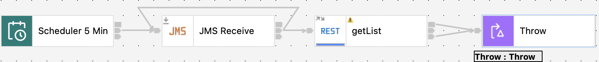
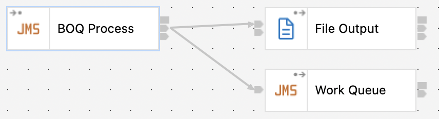

### Example of using App Connect Enterprise (ACE) and IBM MQ in Openshift Container Platform (OCP) to retry and handle messages.
---

The first flow is to handle messages on a Queue that were put there in JMS format after a flow failed to process the message.  The messages will be reprocessed every 5 minutes, as the backend my be temporarily down.  The flow is designed to fail and after 3 attempts, the message will be placed on the MQ Backout Queue.  

The second flow will pickup messages on the MQ Backout Queue and place them on a Work Queue and a message will be written to a log.  Normally an email or other interaction will be used.

---

For OCP the `setup.yaml` can be used to create the project, catalog source, and operators.  The `create-instances.yaml` will create all the necessary instances, Secrets and ConfigMaps.
